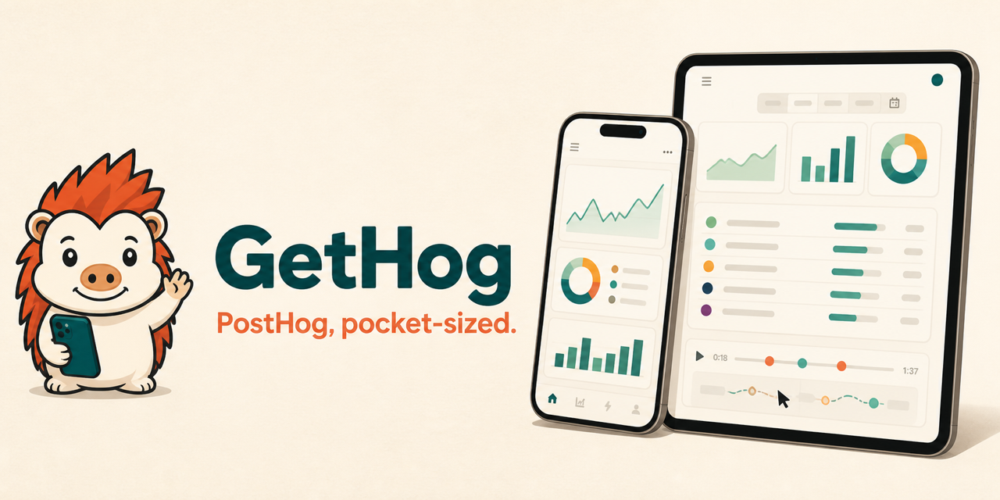

# GetHog



The PostHog companion I wanted on my phone. I built it over a weekend, and then
it got a little out of hand.

<a href="https://apps.apple.com/us/app/gethog/id6798921061">
  
</a>

Available now for iPhone and iPad. The Mac, Vision, TV, and Watch shells build
from the same source; see DEVELOPMENT.md for their schemes and destinations.

> GetHog is an independent community project. It is not affiliated with,
> endorsed by, or maintained by PostHog.

## Why this exists

I wanted to check a dashboard, inspect a replay, or sanity-check a flag without
opening a laptop. The sensible answer was probably “use the website.” The
weekend-project answer was “build the native app I want to use myself,” and here
we are.

**Warning:** side projects may expand when exposed to SwiftUI, analytics APIs,
and the dangerous thought, “replay parsing can’t be *that* much work.”

> **Hey, PostHog folks:** if you like what I’ve built, feel free to give me a
> job. I’d also happily accept some PostHog credits 🙃

## What it can do

GetHog is a native SwiftUI app for iPhone and iPad, with Mac, Vision, TV, and
Watch shells in the same repository. Right now it can:

- Browse saved dashboards and their supported insights.
- Inspect events, people, and sessions, including web-session replay.
- Review feature flags and change a flag only after confirmation.
- Connect to PostHog US Cloud, EU Cloud, or a self-hosted instance.

## Try it without an API key

Demo mode is built in. Its data is fictional and written by hand. Every run
gets the same data, and the UI tests and screenshots use it too. You can poke
around or work on the interface without a PostHog account or credential.

## Getting started

Install Xcode and [XcodeGen](https://github.com/yonaskolb/XcodeGen), then
generate the project:

```bash
brew install xcodegen
xcodegen generate
open GetHog.xcodeproj
```

If you want to connect your account, create a PostHog
[personal API key](https://posthog.com/docs/api/personal-api-keys) with the
scopes shown during onboarding. GetHog stores the key in the device Keychain.
There is no GetHog backend. See [DEVELOPMENT.md](DEVELOPMENT.md) for builds,
tests, demo mode, and credential handling.

## Architecture

```text
GetHogKit/          UI-free Swift package: auth, networking, API models,
                    insight rendering, and replay parsing
GetHogUI/           Cross-platform presentation primitives (theme, charts)
GetHog/Sources/     SwiftUI application, organized by product surface
GetHogMac/          Native Mac shell over the shared screens
GetHogVision/       Spatial catalog over the shared screens
GetHogTV/           Curated read-mostly shell for the living room
GetHogWatch/        Glanceable metrics, flags, health, and activity client
GetHogWidgets/      WidgetKit extension using the shared cache only
GetHog/Resources/   Deterministic demo resources and bundled replay player
```

`project.yml` is the source of truth and `GetHog.xcodeproj` is generated. The
app keeps networking and decoding in `GetHogKit`, where they can be tested
without the UI. Widgets use the shared cache and do not call PostHog directly.

## Project status

GetHog is available on the App Store and still moving quickly. You can use
dashboards, events, people, sessions, replay, and feature flags now. If the app
finds an insight type it cannot draw yet, it tells you instead of making up a
chart.

This is not a replacement for the PostHog web app. Some API surfaces are still
missing. A replay can only show what the original recording captured. Plenty
of analytics work is still better done on a laptop. [ROADMAP.md](ROADMAP.md)
lists the current gaps and what I want to tackle next.

## Contributing

Contributions are welcome and encouraged. If you’ve found GetHog useful,
please star the repo. It helps other people find it.

If you want to send a change, read [CONTRIBUTING.md](CONTRIBUTING.md),
[DEVELOPMENT.md](DEVELOPMENT.md), and the [Code of Conduct](CODE_OF_CONDUCT.md)
before opening a change. Please keep every example, fixture, screenshot, and
attachment synthetic and privacy-safe.

## License

GetHog is available under the [MIT License](LICENSE). See
[THIRD_PARTY_NOTICES.md](THIRD_PARTY_NOTICES.md) for bundled dependencies.
